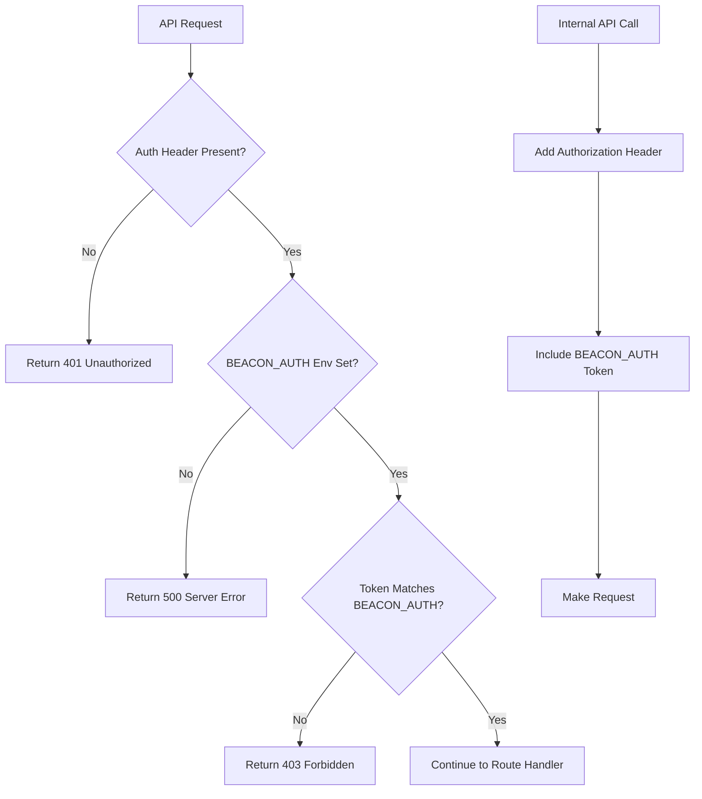

# API Authorization Implementation Plan

## Overview

This document outlines the implementation plan for adding authorization middleware to all API endpoints in the Beacon application. The middleware will check for an Authorization header against the `process.env.BEACON_AUTH` environment variable.

## Current API Structure Analysis

### Protected Endpoints to be Secured

#### 1. User API (`/api/user/*`)

- `GET /api/user/lookup` - Lookup user by alias
- `GET /api/user/:id` - Get user by NPUB
- `POST /api/user` - Create new user
- `PATCH /api/user/:id` - Update user

#### 2. Queue API (`/api/queue/*`)

- `POST /api/queue/add/:queueName` - Add message to queue

#### 3. Conversation API (`/api/conversations/*`)

- `GET /:conversationId/history` - Get conversation history
- `GET /:conversationId/flow/latest` - Get latest flow
- `GET /flow/:flowId/next-action` - Get next action
- `GET /messages/recent` - Get recent beacon messages
- `GET /message/:npub/:messagenumber` - Get messages by npub
- `POST /` - Create new conversation
- `POST /flow` - Create new flow
- `POST /:conversationId/messages` - Add beacon message
- `PATCH /:conversationId/flow` - Update conversation flow
- `POST /message` - Create beacon message
- `GET /message/:messageId` - Get beacon message by ID
- `PATCH /message/:messageId` - Update beacon message
- `GET /:conversationId` - Get conversation by ID
- `PATCH /:conversationId` - Update conversation
- `GET /flow/:flowId` - Get flow by ID
- `PATCH /flow/:flowId` - Update flow
- `PATCH /flow/:flowId/action` - Update flow action

### Internal API Callers Found

1. **[`app/workers/gateways/whatsapp.gateway.worker.js`](app/workers/gateways/whatsapp.gateway.worker.js:81)**

   - Makes POST to `/api/queue/add/bm_in`
   - Current implementation: `axios.post()` without auth header

2. **[`app/utils/userUtils.js`](app/utils/userUtils.js:22)**
   - Makes GET to `/api/user/lookup`
   - Current implementation: `fetch()` without auth header

## Implementation Plan

### Stage 1: Create Authorization Middleware

**Objective:** Create reusable auth middleware that validates Authorization header

**Files to create:**

- [`app/api/middlewares/auth.middleware.js`](app/api/middlewares/auth.middleware.js)

**Implementation Details:**

```javascript
export const requireAuth = (req, res, next) => {
  const authHeader = req.headers.authorization;
  const expectedAuth = process.env.BEACON_AUTH;

  if (!expectedAuth) {
    console.error("[Auth Middleware] BEACON_AUTH environment variable not set");
    return res.status(500).json({
      error: "Server configuration error",
    });
  }

  if (!authHeader) {
    return res.status(401).json({
      error: "Authorization header required",
    });
  }

  // Support both "Bearer token" and direct token formats
  const token = authHeader.startsWith("Bearer ")
    ? authHeader.slice(7)
    : authHeader;

  if (token !== expectedAuth) {
    return res.status(403).json({
      error: "Invalid authorization token",
    });
  }

  next();
};
```

**Testing Plan:**

- Unit tests for middleware with valid/invalid/missing tokens
- Test environment variable validation
- Test both Bearer and direct token formats

### Stage 2: Apply Middleware to Route Files

**Objective:** Protect all API endpoints with authorization

**Files to modify:**

1. [`app/api/routes/user.route.js`](app/api/routes/user.route.js)
2. [`app/api/routes/queue.routes.js`](app/api/routes/queue.routes.js)
3. [`app/api/routes/conversation.route.js`](app/api/routes/conversation.route.js)

**Implementation Pattern:**

```javascript
import { requireAuth } from "../middlewares/auth.middleware.js";

const router = express.Router();

// Apply auth middleware to all routes
router.use(requireAuth);

// Existing route definitions...
```

**Testing Plan:**

- Test each endpoint returns 401 without auth header
- Test each endpoint returns 403 with invalid auth header
- Test each endpoint works with valid auth header

### Stage 3: Update Internal API Callers

**Objective:** Update internal functions to include authorization headers

#### 3.1 WhatsApp Gateway Worker

**File:** [`app/workers/gateways/whatsapp.gateway.worker.js`](app/workers/gateways/whatsapp.gateway.worker.js)

**Current Code (Line 81):**

```javascript
await axios.post(`${baseURL}/api/queue/add/bm_in`, beaconMessagePayload, {
  headers: { "Content-Type": "application/json" },
});
```

**Updated Code:**

```javascript
await axios.post(`${baseURL}/api/queue/add/bm_in`, beaconMessagePayload, {
  headers: {
    "Content-Type": "application/json",
    Authorization: process.env.BEACON_AUTH,
  },
});
```

#### 3.2 User Utils

**File:** [`app/utils/userUtils.js`](app/utils/userUtils.js)

**Current Code (Line 22):**

```javascript
const response = await fetch(url, {
  method: "GET",
  headers: {
    "Content-Type": "application/json",
  },
});
```

**Updated Code:**

```javascript
const response = await fetch(url, {
  method: "GET",
  headers: {
    "Content-Type": "application/json",
    Authorization: process.env.BEACON_AUTH,
  },
});
```

**Testing Plan:**

- Test WhatsApp gateway can still queue messages
- Test user lookup functionality still works
- Test error handling when BEACON_AUTH is missing

### Stage 4: Environment Configuration Validation

**Objective:** Ensure proper environment setup and validation

**Implementation:**

- Add startup validation for `BEACON_AUTH` environment variable
- Update deployment documentation
- Add error handling for missing environment variables

**Testing Plan:**

- Test application startup with missing BEACON_AUTH
- Test application behavior with invalid BEACON_AUTH
- Verify all deployment environments have proper configuration

## Updated API Usage

### CURL Commands with Authorization

After implementation, all API calls will require the Authorization header:

#### Get User by NPUB

```bash
curl -X GET \
  "http://localhost:3256/api/user/{npub}" \
  -H "Content-Type: application/json" \
  -H "Authorization: YOUR_BEACON_AUTH_TOKEN"
```

#### Lookup User by Alias

```bash
curl -X GET \
  "http://localhost:3256/api/user/lookup?type=wa&ref=+1234567890" \
  -H "Content-Type: application/json" \
  -H "Authorization: YOUR_BEACON_AUTH_TOKEN"
```

#### Create User

```bash
curl -X POST \
  "http://localhost:3256/api/user" \
  -H "Content-Type: application/json" \
  -H "Authorization: YOUR_BEACON_AUTH_TOKEN" \
  -d '{
    "npub": "npub1abc123def456...",
    "name": "John Doe"
  }'
```

#### Add Message to Queue

```bash
curl -X POST \
  "http://localhost:3256/api/queue/add/bm_in" \
  -H "Content-Type: application/json" \
  -H "Authorization: YOUR_BEACON_AUTH_TOKEN" \
  -d '{
    "beaconMessage": {
      "id": "message-id",
      "message": { "content": "Hello" }
    }
  }'
```

## Authorization Flow Diagram



## Implementation Order

### Phase 1: Foundation (Safe to deploy)

1. Create auth middleware
2. Update internal API callers
3. Add environment validation

### Phase 2: Protection (Breaking change)

4. Apply middleware to all routes
5. Update documentation
6. Deploy with proper BEACON_AUTH configuration

## Risk Assessment & Mitigation

### Risks

1. **Breaking existing functionality** - Internal calls might fail if auth is applied before updating callers
2. **Environment variable not set** - Could cause 500 errors
3. **Token exposure** - BEACON_AUTH token could be logged or exposed

### Mitigation Strategies

1. **Staged deployment** - Update internal callers first, then apply middleware
2. **Environment validation** - Add startup checks for required env vars
3. **Security practices** - Ensure BEACON_AUTH is properly secured and not logged
4. **Rollback plan** - Keep middleware optional via environment flag during initial deployment

## Response Codes

After implementation, the following response codes will be returned:

- `200/201` - Success (with valid authorization)
- `401` - Unauthorized (missing Authorization header)
- `403` - Forbidden (invalid authorization token)
- `500` - Server Error (BEACON_AUTH environment variable not set)

## Testing Strategy

### Unit Tests

- Auth middleware functionality
- Token validation logic
- Environment variable handling

### Integration Tests

- End-to-end API calls with auth
- Internal service communication
- Error scenarios

### Manual Testing

- Postman collection with auth headers
- WhatsApp gateway message flow
- User lookup functionality

## Deployment Checklist

- [ ] BEACON_AUTH environment variable set in all environments
- [ ] Internal API callers updated with auth headers
- [ ] Auth middleware created and tested
- [ ] Route files updated with middleware
- [ ] Documentation updated
- [ ] Postman collections updated
- [ ] Monitoring and logging configured
- [ ] Rollback plan prepared
