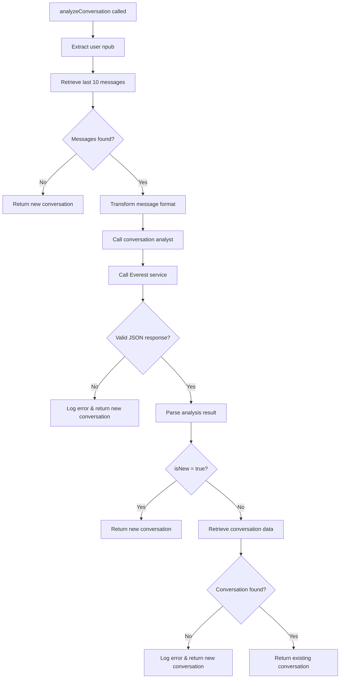

# Conversation Analysis Implementation Plan

## Overview

Update [`app/utils/messageUtils.js`](../app/utils/messageUtils.js) to implement intelligent conversation analysis that determines whether a new message should start a new conversation or continue an existing one.

## Current State Analysis

- ✅ API endpoint `/api/conversations/message/:npub/:messagenumber` exists
- ✅ [`getMessagesByNpub`](../app/api/services/conversation.service.js) service function available
- ✅ [`converstationAnalysis.js`](../app/src/agents/converstationAnalysis.js) agent configured
- ✅ [`everest.service.js`](../app/api/services/everest.service.js) integration ready
- ✅ [`conversation.js`](../app/src/pipeline/conversation.js) pipeline handles conversation assignment

## Implementation Stages

### Stage 1: Data Retrieval & Transformation

**Objective**: Retrieve and format the last 10 messages for analysis

**Changes to [`analyzeConversation`](../app/utils/messageUtils.js) function:**

1. **Import required services**:

   ```javascript
   import {
     getMessagesByNpub,
     getConversationById,
   } from "../api/services/conversation.service.js";
   import converstationAnalyst from "../src/agents/converstationAnalysis.js";
   import { callEverest } from "../api/services/everest.service.js";
   ```

2. **Extract user npub from parameters**:

   - From `user.npub` (if user object provided)
   - From `origin.userNpub` (fallback)

3. **Retrieve last 10 messages**:

   ```javascript
   const recentMessages = await getMessagesByNpub(userNpub, 10);
   ```

4. **Transform to required format**:
   ```javascript
   const contextArray = recentMessages.map((msg) => ({
     message: msg.message.content,
     ts: msg.message.ts,
     conversationRef: msg.conversationRef,
   }));
   ```

**Testing Plan for Stage 1**:

- Verify message retrieval with valid npub
- Test with npub having < 10 messages
- Test with npub having no messages
- Validate data transformation format

### Stage 2: Agent Integration

**Objective**: Integrate conversation analysis agent with Everest service

**Implementation**:

1. **Prepare agent call**:

   ```javascript
   const agentData = await converstationAnalyst(
     message.content,
     contextArray,
     userNpub
   );
   ```

2. **Call Everest service**:
   ```javascript
   const response = await callEverest(agentData, {
     userID: user?._id,
     userNpub: userNpub,
   });
   ```

**Testing Plan for Stage 2**:

- Test agent call with sample message and context
- Verify Everest service integration
- Test error handling for API failures

### Stage 3: Response Processing & Validation

**Objective**: Parse and validate LLM response with graceful error handling

**Implementation**:

1. **JSON Response Validation**:
   ```javascript
   let analysisResult;
   try {
     analysisResult = JSON.parse(response.message);

     // Validate required fields
     if (
       !analysisResult.hasOwnProperty("isNew") ||
       !analysisResult.hasOwnProperty("reasoning") ||
       !analysisResult.hasOwnProperty("conversationRef")
     ) {
       throw new Error("Invalid response format");
     }
   } catch (error) {
     console.error("[MessageUtils] Failed to parse LLM response:", error);
     // Graceful fallback to new conversation
     return {
       isNew: true,
       refId: null,
       data: null,
     };
   }
   ```

**Testing Plan for Stage 3**:

- Test with valid JSON response
- Test with malformed JSON
- Test with missing required fields
- Verify graceful fallback behavior

### Stage 4: Result Mapping & Data Retrieval

**Objective**: Map analysis result to final return format

**Implementation**:

1. **Handle New Conversation Case**:

   ```javascript
   if (analysisResult.isNew === true) {
     return {
       isNew: true,
       refId: null,
       data: null,
     };
   }
   ```

2. **Handle Existing Conversation Case**:
   ```javascript
   if (analysisResult.isNew === false && analysisResult.conversationRef) {
     try {
       const conversationData = await getConversationById(
         analysisResult.conversationRef
       );
       return {
         isNew: false,
         refId: analysisResult.conversationRef,
         data: conversationData,
       };
     } catch (error) {
       console.error("[MessageUtils] Failed to retrieve conversation:", error);
       // Fallback to new conversation
       return {
         isNew: true,
         refId: null,
         data: null,
       };
     }
   }
   ```

**Testing Plan for Stage 4**:

- Test new conversation flow
- Test existing conversation retrieval
- Test with invalid conversation ID
- Verify fallback behavior

### Stage 5: Integration Testing

**Objective**: End-to-end testing with pipeline integration

**Testing Scenarios**:

1. **New Conversation**: Message with no related context
2. **Continuation**: Follow-up question to recent message
3. **Topic Switch**: New topic after existing conversation
4. **Error Scenarios**: Invalid npub, API failures, malformed responses

**Integration Points**:

- [`beaconMessage.worker.js`](../app/workers/beaconMessage.worker.js) calls `analyzeConversation`
- [`conversation.js`](../app/src/pipeline/conversation.js) uses the result for message assignment

## Error Handling Strategy



## Dependencies & Imports Required

```javascript
import {
  getMessagesByNpub,
  getConversationById,
} from "../api/services/conversation.service.js";
import converstationAnalyst from "../src/agents/converstationAnalysis.js";
import { callEverest } from "../api/services/everest.service.js";
```

## Configuration Notes

1. **Agent Configuration**: The [`converstationAnalysis.js`](../app/src/agents/converstationAnalysis.js) agent is already configured with:

   - Model: `llama-3.1-8b-instant` (Groq provider)
   - Response format: `json_object`
   - Temperature: 0.8

2. **Expected Response Format**:
   ```json
   {
     "reasoning": "Why you believe this is the correct thread or a new thread",
     "isNew": true|false,
     "conversationRef": "ObjectId or NULL"
   }
   ```

## Data Flow

### Input Parameters

- `message`: Object containing content, role, messageID, ts, etc.
- `origin`: Object containing channel, gateway details, userNpub
- `user`: Optional user object with npub and \_id

### Process Flow

1. Extract `userNpub` from `user.npub` or `origin.userNpub`
2. Retrieve last 10 messages for the user via `getMessagesByNpub(userNpub, 10)`
3. Transform messages to required format: `{message, ts, conversationRef}`
4. Call conversation analysis agent with current message and context
5. Process LLM response and validate JSON format
6. Map result to return format based on `isNew` flag
7. If continuing conversation, retrieve full conversation data

### Output Format

```javascript
{
  isNew: boolean,     // true = new conversation, false = existing
  refId: string|null, // MongoDB ObjectId of existing conversation
  data: object|null   // Full conversation object if existing
}
```

## Performance Considerations

- Direct database calls via service functions (no HTTP overhead)
- Graceful fallbacks prevent system blocking
- Efficient message retrieval with limit of 10
- Minimal data transformation overhead

## Rollback Strategy

The current hardcoded implementation remains as fallback behavior, ensuring system stability during any failures in the new logic.

## Implementation Checklist

### Stage 1: Data Retrieval & Transformation

- [ ] Add required imports to messageUtils.js
- [ ] Extract userNpub from parameters
- [ ] Implement message retrieval logic
- [ ] Add data transformation
- [ ] Test with various npub scenarios

### Stage 2: Agent Integration

- [ ] Integrate conversation analysis agent
- [ ] Implement Everest service call
- [ ] Add error handling for API failures
- [ ] Test agent integration

### Stage 3: Response Processing

- [ ] Add JSON parsing and validation
- [ ] Implement graceful error handling
- [ ] Test with various response formats
- [ ] Verify fallback behavior

### Stage 4: Result Mapping

- [ ] Handle new conversation case
- [ ] Handle existing conversation case
- [ ] Add conversation data retrieval
- [ ] Test result mapping logic

### Stage 5: Integration Testing

- [ ] End-to-end testing scenarios
- [ ] Pipeline integration verification
- [ ] Performance testing
- [ ] Error scenario testing

## Success Criteria

1. **Functional**: Correctly identifies new vs continuing conversations
2. **Reliable**: Graceful handling of all error scenarios
3. **Performance**: No significant impact on message processing time
4. **Integration**: Seamless integration with existing pipeline
5. **Maintainable**: Clear code structure with comprehensive logging

## Risk Mitigation

1. **LLM Response Failures**: Always fallback to new conversation
2. **Database Errors**: Comprehensive error handling with fallbacks
3. **Performance Impact**: Direct service calls minimize overhead
4. **Integration Issues**: Maintain existing interface contract
5. **Data Consistency**: Validate all data transformations

---

**Next Steps**: Proceed with Stage 1 implementation after plan approval.
