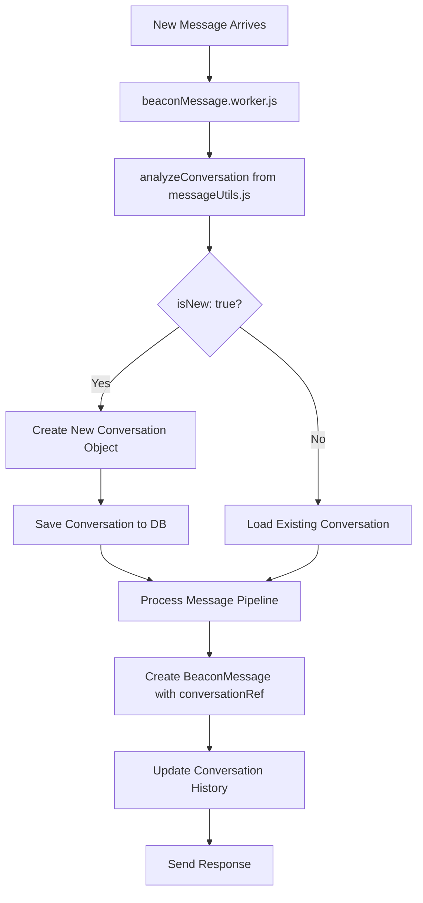

# Conversation Tracking Implementation Plan

## Overview

Implement conversation tracking in the `beaconMessage.worker.js` that creates a new conversation for every incoming message, using a new utility function in `app/utils/messageUtils.js`. This sets up the foundation for future intelligent conversation analysis.

## Architecture



## Implementation Stages

### Stage 1: Create Message Utilities Foundation

**Objective**: Create the `messageUtils.js` with hardcoded conversation detection logic

**Implementation**:

- Create `app/utils/messageUtils.js` with `analyzeConversation()` function
- Return hardcoded response: `{ isNew: true, refId: null, data: null }`
- Include proper JSDoc documentation and error handling

**Test Plan**:

- Unit test the `analyzeConversation()` function
- Verify it returns the expected hardcoded response
- Test with various message inputs to ensure consistent behavior

### Stage 2: Integrate Conversation Analysis into Worker

**Objective**: Modify `beaconMessage.worker.js` to use the new conversation analysis

**Implementation**:

- Import `analyzeConversation` from `messageUtils.js`
- Add conversation analysis step before processing pipeline
- Handle the `existingConversation` object response
- Add logging for conversation analysis results

**Test Plan**:

- Verify worker imports and calls the new utility correctly
- Check that conversation analysis happens before pipeline processing
- Confirm logging shows conversation analysis results

### Stage 3: Implement New Conversation Creation Logic

**Objective**: Create new conversation objects when `isNew: true`

**Implementation**:

- Import `Conversation` model from `models/index.js`
- Create new conversation object with:
  - `history: []` (empty initially, will contain BeaconMessage IDs)
  - `summaryHistory: [{ role: "user", content: message.content }]`
  - `activeFlow: null`
- Save the new conversation to database
- Store conversation ID for linking to BeaconMessage

**Test Plan**:

- Verify new conversation objects are created correctly
- Check that conversation is saved to database
- Confirm conversation structure matches schema requirements

### Stage 4: Link BeaconMessage to Conversation

**Objective**: Associate the processed BeaconMessage with the created conversation

**Implementation**:

- Create BeaconMessage with `conversationRef` pointing to new conversation
- Update conversation's `history` array with BeaconMessage ID
- Update conversation's `summaryHistory` with agent response
- Save both objects to maintain referential integrity

**Test Plan**:

- Verify BeaconMessage has correct `conversationRef`
- Check conversation `history` contains BeaconMessage ID
- Confirm `summaryHistory` includes both user message and agent response
- Test database relationships are properly maintained

### Stage 5: Update Conversation Pipeline Integration

**Objective**: Ensure the conversation pipeline works with the new conversation tracking

**Implementation**:

- Modify `processConversationPipeline()` to accept conversation context
- Pass conversation `summaryHistory` to `conversationAgent()` as history parameter
- Update agent response handling to include conversation context
- Ensure response updates the conversation's `summaryHistory`

**Test Plan**:

- Verify pipeline receives conversation context
- Check that conversation history is passed to agent
- Confirm agent responses update conversation properly
- Test end-to-end message processing with conversation tracking

## File Changes Required

### NEW FILES

1. **`app/utils/messageUtils.js`**

   - `analyzeConversation(message, origin, user)` function
   - Returns hardcoded `{ isNew: true, refId: null, data: null }`

2. **`tests/messageUtils.test.js`**
   - Unit tests for conversation analysis
   - Test hardcoded response behavior

### MODIFIED FILES

1. **`app/workers/beaconMessage.worker.js`**

   - Import `analyzeConversation` and `Conversation` model
   - Add conversation analysis step
   - Create new conversation when `isNew: true`
   - Link BeaconMessage to conversation

2. **`app/src/pipeline/conversation.js`**
   - Accept conversation context parameter
   - Pass conversation history to agent
   - Update conversation after processing

## Data Flow Example

### Input Message

```javascript
const message = {
  content: "Hey what can you do?",
  role: "user",
  messageID: "msg123",
  ts: 1672531200,
};
```

### analyzeConversation Response

```javascript
const existingConversation = {
  isNew: true,
  refId: null,
  data: null,
};
```

### New Conversation Created

```javascript
const conversation = {
  _id: ObjectId("..."),
  history: [], // Will contain BeaconMessage IDs
  summaryHistory: [{ role: "user", content: "Hey what can you do?" }],
  activeFlow: null,
};
```

### After Agent Response

```javascript
const updatedConversation = {
  _id: ObjectId("..."),
  history: [ObjectId("beaconMsg123")],
  summaryHistory: [
    { role: "user", content: "Hey what can you do?" },
    { role: "agent", content: "I'm the Beacon, I can help you with..." },
  ],
  activeFlow: null,
};
```

## messageUtils.js API Specification

### analyzeConversation Function

```javascript
/**
 * Analyzes a message to determine conversation context
 * @param {Object} message - The message object containing content, role, etc.
 * @param {Object} origin - The origin information (channel, gateway details)
 * @param {Object} user - The user object (optional)
 * @returns {Object} existingConversation object
 */
export function analyzeConversation(message, origin, user = null) {
  // For now, always return new conversation
  return {
    isNew: true, // boolean: true = new conversation, false = existing
    refId: null, // string: MongoDB ObjectId of existing conversation (null if isNew = true)
    data: null, // object: conversation object if existing (null if isNew = true)
  };
}
```

## Future Extension Points

1. **Conversation Analysis Agent**: Replace hardcoded logic in `messageUtils.js`
2. **Conversation Merging**: Logic to combine related conversations
3. **Context Window Management**: Trim old history when conversations get long
4. **Flow Integration**: Automatic flow creation based on conversation type

## Testing Strategy

### Unit Tests

- `messageUtils.js` functions
- Conversation creation logic
- BeaconMessage linking logic

### Integration Tests

- End-to-end message processing
- Database operations
- Pipeline integration

### Manual Testing

- Send test messages through WhatsApp gateway
- Verify conversations are created in database
- Check conversation history tracking
- Confirm agent responses include conversation context

## Success Criteria

1. Every new message creates a new conversation
2. Conversations are properly saved to database
3. BeaconMessages are linked to conversations
4. Conversation history is maintained
5. Agent responses update conversation summaryHistory
6. No breaking changes to existing functionality
7. All tests pass
8. System performance remains acceptable

## Implementation Notes

- Follow ES Module patterns (project uses ES Modules exclusively)
- Use existing error handling patterns from the codebase
- Maintain consistency with existing logging format
- Ensure proper database transaction handling
- Follow existing code style and documentation standards
