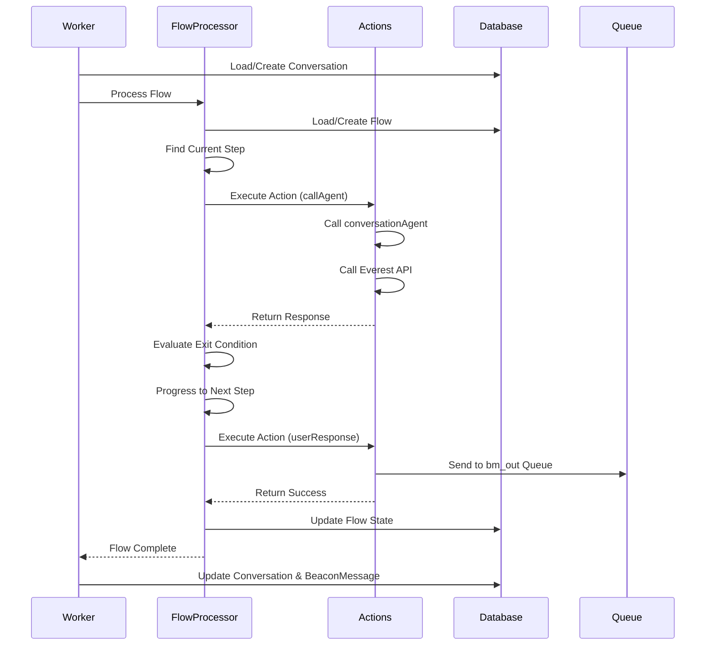
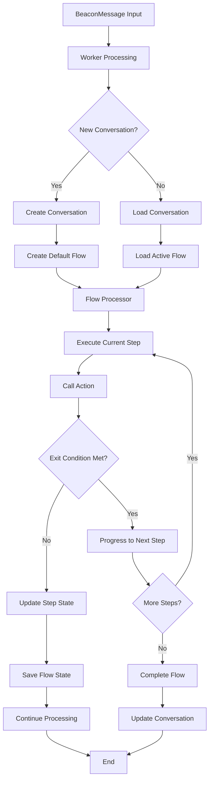

# Flow Management Implementation Plan

## Overview

This plan implements a flow management system that allows conversations to follow predefined workflows with multiple steps, actions, and exit conditions. The system will be integrated into the existing beaconMessage worker to replace the current direct pipeline processing.

## Current State Analysis

- **beaconMessage.worker.js**: Currently uses `processConversationPipeline()` directly
- **Action files**: Empty and need to be implemented
- **Flow model**: Already defined in `models/index.js`
- **Conversation flow**: Template exists but needs proper implementation

## Implementation Stages

### Stage 1: Create Action System

**Objective**: Implement the action functions that flows will call

**Files to create/modify**:

1. `app/src/actions/callAgent.action.js`
2. `app/src/actions/userResponse.action.js`
3. `app/src/actions/index.js` (new - action registry)

**Implementation details**:

- **callAgent.action.js**: Extract logic from `processConversationPipeline()` to call agents and Everest API
- **userResponse.action.js**: Handle formatting and sending responses to bm_out queue
- **Action registry**: Central registry for all available actions

**Test plan**:

- Unit tests for each action functionx
- Integration test calling actions directly with mock data
- Verify actions return expected output format

### Stage 2: Create Flow Processor

**Objective**: Build the core flow execution engine

**Files to create**:

1. `app/src/flows/flowProcessor.js` (new)
2. `app/src/flows/flowUtils.js` (new)

**Implementation details**:

```javascript
// Flow processor will:
// 1. Load flow definition
// 2. Find current step based on state
// 3. Execute action with provided arguments
// 4. Evaluate exit conditions
// 5. Update flow state and progress to next step
// 6. Save flow state to database
```

**Test plan**:

- Unit tests for flow step execution
- Test exit condition evaluation
- Test flow state management
- Mock action calls to verify flow progression

### Stage 3: Implement Conversation Flow

**Objective**: Create the default conversation flow definition

**Files to modify**:

1. `app/src/flows/conversation.flow.js`

**Implementation details**:

```javascript
// Conversation flow structure:
{
  type: "conversation",
  workflow: [
    {
      order: 1,
      action: "callAgent",
      args: ["conversationAgent", "beaconMessage", "conversation"],
      output: null,
      exit: { field: "output", eval: "!=", value: null },
      state: "open"
    },
    {
      order: 2,
      action: "userResponse",
      args: ["beaconMessage"],
      output: null,
      exit: { field: "output", eval: "!=", value: null },
      state: "open"
    }
  ],
  state: "initialized",
  data: []
}
```

**Test plan**:

- Test flow creation with conversation context
- Verify flow definition matches expected structure
- Test flow execution end-to-end

### Stage 4: Integrate Flow Management into Worker

**Objective**: Replace direct pipeline processing with flow-based processing

**Files to modify**:

1. `app/workers/beaconMessage.worker.js`

**Implementation details**:

- Replace `processConversationPipeline()` call with flow processing
- Create new flows for new conversations
- Resume existing flows for ongoing conversations
- Update conversation and BeaconMessage models with flow references

**Test plan**:

- Integration test with new conversation (creates new flow)
- Integration test with existing conversation (resumes flow)
- Test flow state persistence
- Test error handling and recovery

### Stage 5: Database Integration and Flow Persistence

**Objective**: Ensure flows are properly saved and retrieved from database

**Files to modify**:

1. `app/workers/beaconMessage.worker.js` (flow persistence)
2. `models/index.js` (verify Flow model)

**Implementation details**:

- Save flow instances to database
- Link flows to conversations via `activeFlow` field
- Update `BeaconMessage` with `flowRef`
- Handle flow state updates and persistence

**Test plan**:

- Test flow creation and database save
- Test flow retrieval and state restoration
- Test conversation-flow linking
- Test BeaconMessage-flow linking

## Flow Execution Sequence Diagram



## Data Flow Architecture



## Flow Structure Definition

### Flow Object Structure

```javascript
{
  id: "unique-flow-id",
  type: "conversation | research | websearch",
  workflow: [
    {
      order: 1,
      action: "actionName",
      args: ["arg1", "arg2", "arg3"],
      output: null, // populated after execution
      exit: {
        field: "output",
        eval: "!= | == | > | < | contains",
        value: "comparisonValue"
      },
      state: "open | complete"
    }
  ],
  state: "description of current state",
  data: [
    { key: "value" },
    { key: "value" }
  ],
  conversationRef: "ObjectId reference to conversation"
}
```

### Action Function Signature

```javascript
async function actionName(context, ...args) {
  // context contains: beaconMessage, conversation, flow, step
  // args are the arguments defined in the workflow step

  // Perform action logic

  // Return result that will be stored in step.output
  return result;
}
```

### Exit Condition Evaluation

```javascript
function evaluateExitCondition(step) {
  const { field, eval: operator, value } = step.exit;
  const fieldValue = step[field];

  switch (operator) {
    case "!=":
      return fieldValue != value;
    case "==":
      return fieldValue == value;
    case ">":
      return fieldValue > value;
    case "<":
      return fieldValue < value;
    case "contains":
      return fieldValue && fieldValue.includes(value);
    default:
      return false;
  }
}
```

## Error Handling Strategy

1. **Action Failures**: Retry mechanism with exponential backoff
2. **Flow State Corruption**: Fallback to direct pipeline processing
3. **Database Errors**: Queue job retry with error logging
4. **Exit Condition Evaluation**: Default to progression on evaluation errors

## Testing Strategy

Each stage will include:

- **Unit Tests**: Individual component testing using Jest
- **Integration Tests**: Cross-component interaction testing
- **End-to-End Tests**: Full workflow testing
- **Human Testing**: Manual verification at each stage

### Test Files to Create

- `tests/actions/callAgent.test.js`
- `tests/actions/userResponse.test.js`
- `tests/flows/flowProcessor.test.js`
- `tests/flows/conversation.flow.test.js`
- `tests/integration/flow-management.test.js`

## Migration Strategy

1. **Backward Compatibility**: Keep existing pipeline as fallback
2. **Feature Flag**: Environment variable to enable/disable flow processing
3. **Gradual Rollout**: Test with subset of conversations first
4. **Monitoring**: Extensive logging for flow execution tracking

## Configuration

### Environment Variables

```bash
ENABLE_FLOW_PROCESSING=true  # Enable/disable flow processing
FLOW_RETRY_ATTEMPTS=3        # Number of retry attempts for failed actions
FLOW_RETRY_DELAY=1000        # Initial retry delay in milliseconds
```

### Default Flow Assignment

- New conversations automatically get "conversation" flow
- Flow type can be determined by intent analysis in future iterations
- Flows are persisted in database and linked to conversations

## Performance Considerations

1. **Database Queries**: Minimize flow state updates
2. **Memory Usage**: Clean up completed flows periodically
3. **Concurrency**: Handle multiple flows per conversation safely
4. **Caching**: Cache flow definitions to reduce database reads

## Future Enhancements

1. **Dynamic Flow Selection**: Choose flow based on message intent
2. **Flow Branching**: Conditional workflow paths
3. **Flow Templates**: Reusable flow definitions
4. **Flow Analytics**: Track flow performance and completion rates
5. **Flow Editor**: UI for creating and editing flows
6. **Flow Debugging**: Enhanced logging and debugging tools

## Implementation Timeline

- **Stage 1**: 1-2 days (Actions)
- **Stage 2**: 2-3 days (Flow Processor)
- **Stage 3**: 1 day (Conversation Flow)
- **Stage 4**: 2-3 days (Worker Integration)
- **Stage 5**: 1-2 days (Database Integration)
- **Testing & Refinement**: 2-3 days

**Total Estimated Time**: 9-14 days

## Success Criteria

1. ✅ All existing conversation functionality preserved
2. ✅ New conversations automatically use flow-based processing
3. ✅ Flow state persisted and recoverable
4. ✅ Actions execute successfully and return expected outputs
5. ✅ Exit conditions properly evaluated
6. ✅ Comprehensive test coverage (>90%)
7. ✅ Performance equivalent to or better than current implementation
8. ✅ Error handling and recovery mechanisms working
9. ✅ Documentation complete and up-to-date
10. ✅ Human testing validates end-to-end functionality
