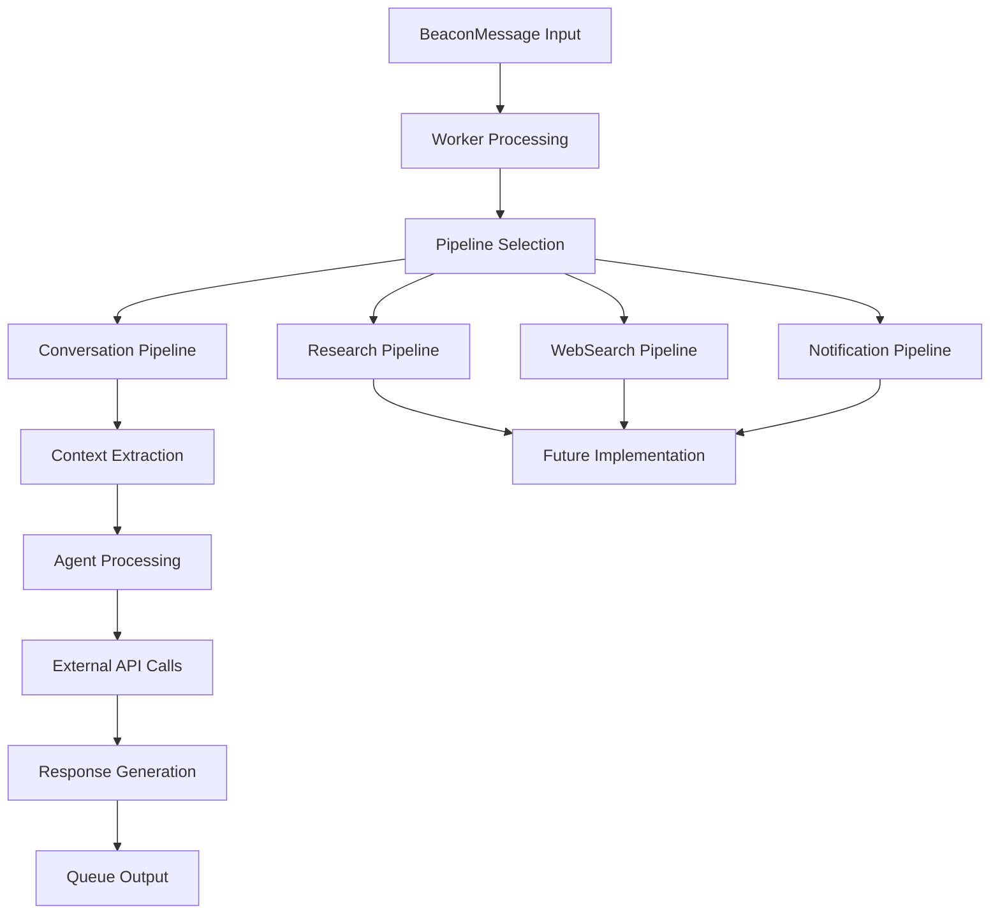
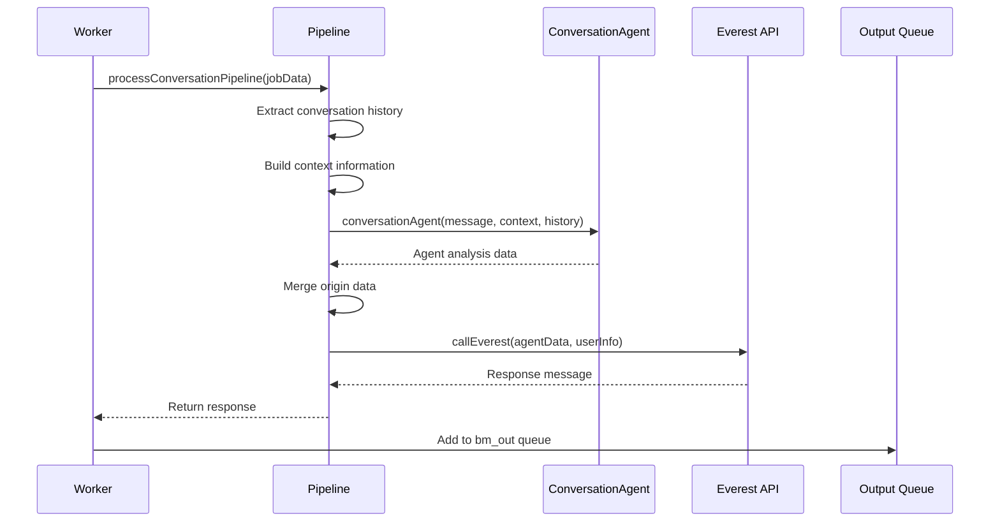

# Pipeline System Design Document

## Overview

The pipeline system in the Beacon project represents a **procedural, code-based approach** to processing messages through a series of sequential operations. Unlike the declarative flow system, pipelines are explicit JavaScript functions that execute operations directly, providing immediate execution paths with minimal overhead.

Pipelines serve as the current implementation approach for message processing, handling the transformation of incoming beacon messages through agent analysis, external API calls, and response generation.

## Current State Analysis

- **Primary Implementation**: [`app/src/pipeline/conversation.js`](app/src/pipeline/conversation.js:1) - Handles conversation-based message processing
- **Worker Integration**: [`app/workers/beaconMessage.worker.js`](app/workers/beaconMessage.worker.js:140) calls pipelines directly
- **Testing Coverage**: Comprehensive integration tests in [`tests/pipeline.integration.test.js`](tests/pipeline.integration.test.js:1)
- **Future Expansion**: Architecture designed for multiple pipeline types

## Pipeline Architecture

### Core Components



### Pipeline Processing Lifecycle



## Current Pipeline Implementation

### Conversation Pipeline

The [`processConversationPipeline()`](app/src/pipeline/conversation.js:9) function demonstrates the core pipeline pattern:

```javascript
export async function processConversationPipeline(jobData) {
  // 1. Context Extraction
  let conversationHistory = [];
  let contextInfo = `The users name is: ${
    jobData.beaconMessage.user?.name || "Unknown"
  }.\n`;

  // 2. History Processing
  if (jobData.conversation && jobData.conversation.summaryHistory) {
    const rawHistory = jobData.conversation.summaryHistory.slice(0, -1);
    conversationHistory = rawHistory.map((msg) => ({
      role: msg.role,
      content: msg.content,
    }));
    contextInfo += `This is part of an ongoing conversation with ${conversationHistory.length} previous messages.\n`;
  }

  // 3. Agent Processing
  const agentData = await conversationAgent(
    jobData.beaconMessage.message.content,
    contextInfo,
    conversationHistory
  );

  // 4. Data Merging
  agentData.origin = {
    ...agentData.origin,
    ...jobData.beaconMessage.origin,
  };

  // 5. External API Call
  const response = await callEverest(agentData, {
    userID: user._id,
    userNpub: user.npub,
  });

  // 6. Response Return
  return response.message;
}
```

### Key Processing Steps

1. **Context Extraction**: Builds user context and conversation state
2. **History Processing**: Cleans and formats conversation history
3. **Agent Processing**: Calls specialized agents for analysis
4. **Data Merging**: Combines agent data with message origin
5. **External API Integration**: Processes through Everest API
6. **Response Generation**: Returns formatted response

## Pipeline Types & Extensibility

### Current Implementation

- **Conversation Pipeline**: Handles conversational message processing
  - File: [`app/src/pipeline/conversation.js`](app/src/pipeline/conversation.js:1)
  - Purpose: User conversations, context-aware responses
  - Integration: Direct worker integration

### Planned Pipeline Types

#### Research Pipeline

```javascript
// app/src/pipeline/research.js
export async function processResearchPipeline(jobData) {
  // 1. Extract research query
  // 2. Call research agent
  // 3. Perform data gathering
  // 4. Synthesize findings
  // 5. Format research response
}
```

#### WebSearch Pipeline

```javascript
// app/src/pipeline/websearch.js
export async function processWebSearchPipeline(jobData) {
  // 1. Parse search intent
  // 2. Execute web search
  // 3. Filter and rank results
  // 4. Summarize findings
  // 5. Return search response
}
```

#### Notification Pipeline

```javascript
// app/src/pipeline/notification.js
export async function processNotificationPipeline(jobData) {
  // 1. Validate notification data
  // 2. Format notification content
  // 3. Determine delivery channels
  // 4. Schedule or send immediately
  // 5. Track delivery status
}
```

## Pipeline Structure & Patterns

### Standard Pipeline Function Signature

```javascript
/**
 * Standard pipeline function signature
 * @param {Object} jobData - Complete job data from worker
 * @param {Object} jobData.beaconMessage - The beacon message to process
 * @param {Object} jobData.conversation - Conversation context (if available)
 * @param {Object} jobData.user - User information
 * @returns {Promise<string>} Processed response message
 */
export async function processPipeline(jobData) {
  // Pipeline implementation
}
```

### Input Data Structure

```javascript
const jobData = {
  beaconMessage: {
    message: {
      content: "User message content",
      role: "user",
      messageID: "unique_message_id",
      ts: 1640995200,
    },
    origin: {
      channel: "beacon.whatsapp",
      gatewayUserID: "user_gateway_id",
      gatewayMessageID: "gateway_message_id",
      userNpub: "user_nostr_public_key",
    },
    user: {
      _id: "user_object_id",
      name: "User Name",
      npub: "user_nostr_public_key",
    },
  },
  conversation: {
    _id: "conversation_id",
    history: ["message_id_1", "message_id_2"],
    summaryHistory: [
      { role: "user", content: "Previous message" },
      { role: "assistant", content: "Previous response" },
    ],
    activeFlow: null,
  },
};
```

### Error Handling Patterns

```javascript
export async function processPipeline(jobData) {
  try {
    // Validate required data
    const user = jobData.beaconMessage.user;
    if (!user) {
      throw new Error("User object is required for pipeline processing");
    }

    // Process with error boundaries
    const agentData = await conversationAgent(/* ... */);
    const response = await callEverest(agentData, userInfo);

    return response.message;
  } catch (error) {
    console.error("[Pipeline] Processing error:", error);
    throw error; // Re-throw for worker handling
  }
}
```

## Integration with Worker System

### Worker Pipeline Integration

The [`beaconMessage.worker.js`](app/workers/beaconMessage.worker.js:140) integrates pipelines through direct function calls:

```javascript
// Import pipeline
import { processConversationPipeline } from "../src/pipeline/conversation.js";

// Worker processing
const worker = new Worker(QUEUE_NAME, async (job) => {
  // ... setup and validation ...

  try {
    // Process through pipeline
    const responseMessage = await processConversationPipeline(job.data);

    // Handle response
    const whatsappMessage = {
      chatID: job.data.beaconMessage.origin.gatewayUserID,
      message: responseMessage,
      options: {
        quotedMessageId: job.data.beaconMessage.message.replyTo,
      },
    };

    // Queue output
    await addMessageToQueue("bm_out", whatsappMessage, "sendWhatsAppMessage");
  } catch (error) {
    console.error("[Worker] Pipeline processing error:", error);
    throw error;
  }
});
```

### Data Preparation Flow

1. **User Lookup**: Worker resolves user from gateway ID
2. **Conversation Analysis**: Worker loads or creates conversation context
3. **Data Assembly**: Worker prepares complete jobData object
4. **Pipeline Execution**: Worker calls appropriate pipeline function
5. **Response Handling**: Worker processes pipeline output
6. **Queue Management**: Worker adds response to output queue

## Testing Strategy

### Unit Testing Approach

Pipeline testing focuses on isolated function testing with mocked dependencies:

```javascript
// tests/pipeline.integration.test.js
import { processConversationPipeline } from "../app/src/pipeline/conversation.js";
import conversationAgent from "../app/src/agents/conversationAgent.js";
import { callEverest } from "../app/api/services/everest.service.js";

jest.mock("../app/src/agents/conversationAgent.js");
jest.mock("../app/api/services/everest.service.js");

describe("Conversation Pipeline", () => {
  test("should process new conversation without history", async () => {
    // Setup mocks
    conversationAgent.mockResolvedValue({
      analysis: "user_inquiry",
      intent: "account_help",
      confidence: 0.9,
    });

    callEverest.mockResolvedValue({
      message: "Response from Everest API",
    });

    // Execute pipeline
    const result = await processConversationPipeline(jobData);

    // Verify results
    expect(result).toBe("Response from Everest API");
    expect(conversationAgent).toHaveBeenCalledWith(/* ... */);
    expect(callEverest).toHaveBeenCalledWith(/* ... */);
  });
});
```

### Integration Testing Patterns

1. **End-to-End Flow**: Test complete pipeline with real dependencies
2. **Error Scenarios**: Test failure modes and error propagation
3. **Data Validation**: Test input validation and data transformation
4. **Performance Testing**: Measure pipeline execution time

### Test Coverage Areas

- **New Conversation Processing**: No history context
- **Existing Conversation Processing**: With conversation history
- **Error Handling**: Agent failures, API failures, data validation
- **Data Flow**: Origin merging, context building, response formatting
- **Performance**: Large conversation histories, concurrent processing

## Performance Characteristics

### Execution Profile

- **Direct Function Calls**: Minimal overhead, immediate execution
- **Sequential Processing**: Operations execute in order without parallelization
- **Memory Efficiency**: No intermediate state storage beyond function scope
- **Error Propagation**: Direct error bubbling to worker level

### Performance Metrics

```javascript
// Performance testing example
test("should complete pipeline processing within reasonable time", async () => {
  const startTime = Date.now();
  await processConversationPipeline(jobData);
  const endTime = Date.now();

  expect(endTime - startTime).toBeLessThan(1000); // < 1 second
});
```

### Optimization Strategies

1. **Context Caching**: Cache user context between pipeline calls
2. **Agent Pooling**: Reuse agent instances for multiple requests
3. **Parallel Processing**: Execute independent operations concurrently
4. **Response Streaming**: Stream responses for long-running operations

## Flow vs Pipeline Comparison

### Architectural Differences

| Aspect            | Pipelines                       | Flows                            |
| ----------------- | ------------------------------- | -------------------------------- |
| **Definition**    | Procedural JavaScript functions | JSON-based workflow definitions  |
| **Execution**     | Direct function calls           | Step-by-step action execution    |
| **Configuration** | Code-based, requires deployment | JSON-based, runtime configurable |
| **Flexibility**   | High programming flexibility    | Structured workflow flexibility  |
| **Performance**   | Minimal overhead                | Action registry overhead         |
| **Debugging**     | Standard debugging tools        | Flow state inspection            |
| **Testing**       | Unit/integration testing        | Flow simulation testing          |

### Implementation Comparison

#### Pipeline Implementation

```javascript
// Direct procedural approach
export async function processConversationPipeline(jobData) {
  const context = buildContext(jobData);
  const agentData = await conversationAgent(message, context, history);
  agentData.origin = { ...agentData.origin, ...jobData.beaconMessage.origin };
  const response = await callEverest(agentData, userInfo);
  return response.message;
}
```

#### Flow Implementation

```javascript
// JSON-based workflow definition
{
  type: "conversation",
  workflow: [
    {
      order: 1,
      action: "callAgent",
      args: ["conversationAgent", "beaconMessage", "conversation"],
      exit: { field: "output", eval: "!=", value: null }
    },
    {
      order: 2,
      action: "userResponse",
      args: ["beaconMessage"],
      exit: { field: "output", eval: "!=", value: null }
    }
  ]
}
```

### When to Choose Each Approach

#### Choose Pipelines When:

1. **Complex Logic Required**: Multi-step algorithms, complex data transformations
2. **Performance Critical**: Low-latency requirements, high-throughput processing
3. **Tight Integration**: Deep integration with existing code, shared utilities
4. **Development Speed**: Rapid prototyping, immediate implementation needs
5. **Custom Error Handling**: Specific error recovery patterns, complex validation

#### Choose Flows When:

1. **Business Process Automation**: Configurable workflows, business rule changes
2. **Non-Technical Configuration**: Business users need to modify workflows
3. **Audit Requirements**: Step-by-step execution tracking, compliance needs
4. **Dynamic Workflows**: Runtime workflow modification, A/B testing
5. **Standardized Operations**: Reusable action patterns, consistent execution

### Migration Considerations

#### Pipeline to Flow Migration Path

1. **Extract Actions**: Convert pipeline steps to reusable actions
2. **Define Flow Structure**: Create JSON workflow definitions
3. **Implement Action Registry**: Build action execution framework
4. **Gradual Migration**: Migrate pipelines one at a time
5. **Maintain Compatibility**: Keep pipelines as fallback option

#### Hybrid Approach

```javascript
// Worker can choose between pipeline and flow
if (useFlowProcessing) {
  await processFlow(job.data);
} else {
  await processConversationPipeline(job.data);
}
```

## Future Architecture Considerations

### Pipeline Registry System

```javascript
// app/src/pipeline/registry.js
const pipelineRegistry = {
  conversation: processConversationPipeline,
  research: processResearchPipeline,
  websearch: processWebSearchPipeline,
  notification: processNotificationPipeline,
};

export function getPipeline(type) {
  return pipelineRegistry[type];
}
```

### Dynamic Pipeline Selection

```javascript
// Worker with dynamic pipeline selection
const pipelineType = determinePipelineType(job.data.beaconMessage);
const pipeline = getPipeline(pipelineType);
const response = await pipeline(job.data);
```

### Pipeline Composition

```javascript
// Composite pipeline for complex workflows
export async function processCompositePipeline(jobData) {
  const analysisResult = await processAnalysisPipeline(jobData);

  if (analysisResult.requiresResearch) {
    return await processResearchPipeline(jobData);
  } else {
    return await processConversationPipeline(jobData);
  }
}
```

### Pipeline Middleware

```javascript
// Pipeline middleware for cross-cutting concerns
export function withLogging(pipeline) {
  return async (jobData) => {
    console.log(`[Pipeline] Starting ${pipeline.name}`);
    const result = await pipeline(jobData);
    console.log(`[Pipeline] Completed ${pipeline.name}`);
    return result;
  };
}

export function withErrorHandling(pipeline) {
  return async (jobData) => {
    try {
      return await pipeline(jobData);
    } catch (error) {
      console.error(`[Pipeline] Error in ${pipeline.name}:`, error);
      throw error;
    }
  };
}
```

## Configuration and Environment

### Environment Variables

```bash
# Pipeline-specific configuration
PIPELINE_TIMEOUT=30000           # Pipeline execution timeout
PIPELINE_RETRY_ATTEMPTS=3        # Retry attempts for failed pipelines
PIPELINE_CONCURRENT_LIMIT=10     # Maximum concurrent pipeline executions
ENABLE_PIPELINE_LOGGING=true     # Enable detailed pipeline logging
```

### Pipeline Configuration

```javascript
// app/config/pipeline.config.js
export const pipelineConfig = {
  conversation: {
    timeout: 30000,
    retryAttempts: 3,
    enableLogging: true,
  },
  research: {
    timeout: 60000,
    retryAttempts: 2,
    enableLogging: true,
  },
};
```

## Error Handling and Recovery

### Error Categories

1. **Validation Errors**: Missing required data, malformed input
2. **Service Errors**: Agent failures, API unavailability
3. **Processing Errors**: Logic errors, unexpected data formats
4. **Timeout Errors**: Long-running operations, network delays

### Recovery Strategies

```javascript
export async function processWithRetry(pipeline, jobData, maxRetries = 3) {
  for (let attempt = 1; attempt <= maxRetries; attempt++) {
    try {
      return await pipeline(jobData);
    } catch (error) {
      if (attempt === maxRetries) {
        throw error;
      }

      const delay = Math.pow(2, attempt) * 1000; // Exponential backoff
      await new Promise((resolve) => setTimeout(resolve, delay));
    }
  }
}
```

## Monitoring and Observability

### Pipeline Metrics

```javascript
// Pipeline execution metrics
const pipelineMetrics = {
  executionTime: Date.now() - startTime,
  pipelineType: "conversation",
  success: true,
  errorType: null,
  messageSize: jobData.beaconMessage.message.content.length,
  conversationLength: jobData.conversation?.history?.length || 0,
};
```

### Logging Strategy

```javascript
// Structured logging for pipelines
console.log("[Pipeline]", {
  type: "conversation",
  stage: "agent_processing",
  messageId: jobData.beaconMessage.message.messageID,
  userId: jobData.beaconMessage.user?._id,
  timestamp: new Date().toISOString(),
});
```

## Success Criteria

1. ✅ **Clear Architecture Documentation**: Pipeline structure and patterns documented
2. ✅ **Implementation Examples**: Working code examples for each pattern
3. ✅ **Integration Guidelines**: Clear worker integration patterns
4. ✅ **Testing Strategy**: Comprehensive testing approach defined
5. ✅ **Performance Characteristics**: Execution profiles and optimization strategies
6. ✅ **Flow Comparison**: Clear differentiation between pipelines and flows
7. ✅ **Future Roadmap**: Extensibility and migration considerations
8. ✅ **Error Handling**: Robust error handling and recovery patterns
9. ✅ **Configuration Management**: Environment and runtime configuration
10. ✅ **Monitoring Strategy**: Observability and debugging approaches

## Conclusion

The pipeline system provides a robust, performant foundation for message processing in the Beacon project. Its procedural nature offers immediate execution with minimal overhead, making it ideal for performance-critical operations and complex logic implementation.

While flows offer configurability and business process automation capabilities, pipelines excel in scenarios requiring tight integration, custom logic, and high-performance processing. The choice between pipelines and flows should be based on specific use case requirements, with the possibility of hybrid approaches for maximum flexibility.

The current conversation pipeline serves as an excellent foundation for future pipeline types, demonstrating clear patterns for context extraction, agent integration, and response generation that can be extended to research, web search, and notification scenarios.
