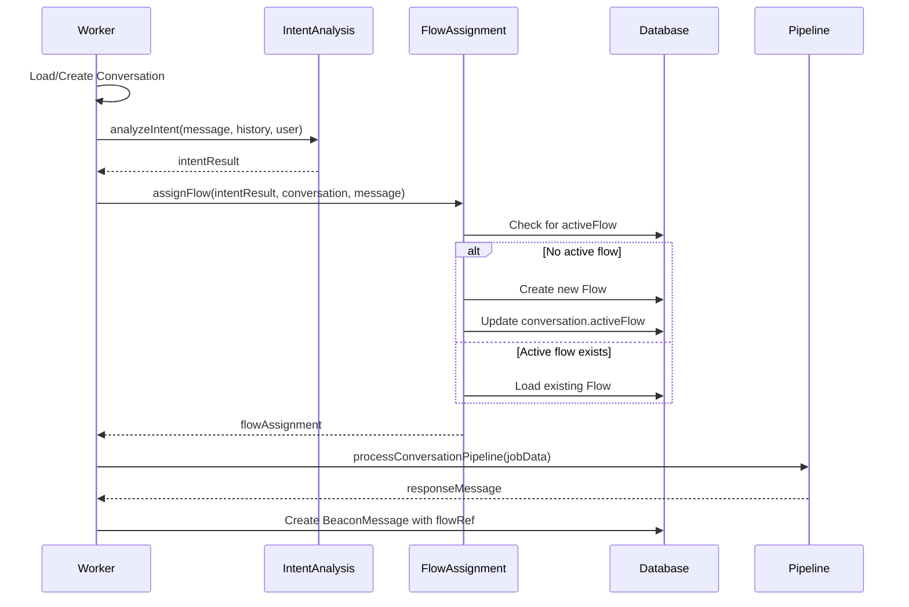
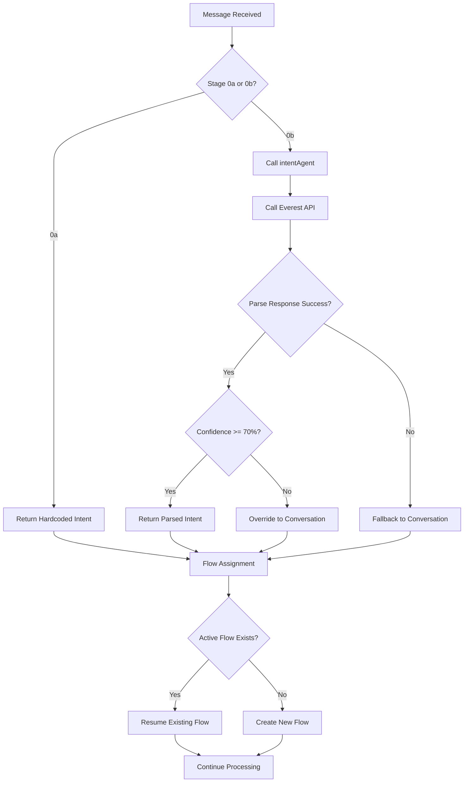

# Stage 0 Implementation Plan: Intent Analysis Hook and Flow Assignment

## Overview

Stage 0 implements intent analysis and flow assignment functionality in the beaconMessage worker. This stage has two sub-stages:

- **Stage 0a**: Hardcoded intent analysis (for testing the integration)
- **Stage 0b**: Dynamic intent analysis using the existing intentAgent

## Current State Analysis

Based on review of the codebase:

- **[`beaconMessage.worker.js`](../../app/workers/beaconMessage.worker.js)**: Currently processes messages through [`processConversationPipeline()`](../../app/src/pipeline/conversation.js:9) at line 140
- **[`intentAgent.js`](../../app/src/agents/intentAgent.js)**: Already exists and returns agent call details for intent analysis
- **Models**: Flow model exists with proper schema, Conversation model has `activeFlow` field
- **Action files**: Empty and ready for implementation
- **Integration point**: Line 136-140 in beaconMessage.worker.js is the perfect insertion point

## Stage 0a: Hardcoded Intent Analysis

### Files to Create

#### 1. [`app/src/utils/intentAnalysis.js`](../../app/src/utils/intentAnalysis.js)

**Purpose**: Utility function that returns hardcoded intent analysis results for testing

**Implementation**:

```javascript
// app/src/utils/intentAnalysis.js

/**
 * Analyzes the intent of a conversation message
 * Stage 0a: Returns hardcoded intent for testing integration
 * @param {string} messageContent - The user's message content
 * @param {Array} conversationHistory - Previous messages in conversation
 * @param {Object} userContext - User information
 * @returns {Promise<Object>} Intent analysis result
 */
export async function analyzeIntent(
  messageContent,
  conversationHistory = [],
  userContext = {}
) {
  console.log("[IntentAnalysis] Stage 0a: Using hardcoded intent analysis");
  console.log(
    "[IntentAnalysis] Message content:",
    messageContent?.substring(0, 100) + "..."
  );
  console.log("[IntentAnalysis] History length:", conversationHistory.length);

  // Stage 0a: Return hardcoded intent
  const intentResult = {
    reasoning: "this is a conversation",
    intent: "conversation",
    confidence: 100,
    timestamp: new Date().toISOString(),
  };

  console.log("[IntentAnalysis] Hardcoded intent result:", intentResult);
  return intentResult;
}
```

#### 2. [`app/src/flows/flowAssignment.js`](../../app/src/flows/flowAssignment.js)

**Purpose**: Maps intent types to flow assignments and manages flow creation

**Implementation**:

```javascript
// app/src/flows/flowAssignment.js
import { Flow } from "../../../models/index.js";

/**
 * Maps intent types to their corresponding flow types
 */
const INTENT_TO_FLOW_MAP = {
  conversation: "conversation",
  research: "research",
  publish: "publish",
  settings: "settings",
};

/**
 * Assigns a flow based on intent analysis result
 * @param {Object} intentResult - Result from intent analysis
 * @param {Object} conversation - Conversation object
 * @param {Object} beaconMessage - Current beacon message
 * @returns {Promise<Object>} Flow assignment result
 */
export async function assignFlow(intentResult, conversation, beaconMessage) {
  console.log("[FlowAssignment] Processing intent:", intentResult.intent);
  console.log("[FlowAssignment] Conversation ID:", conversation._id);

  try {
    // Check if conversation already has an active flow
    if (conversation.activeFlow) {
      console.log(
        "[FlowAssignment] Conversation already has active flow:",
        conversation.activeFlow
      );

      // Load existing flow
      const existingFlow = await Flow.findById(conversation.activeFlow);
      if (existingFlow) {
        console.log(
          "[FlowAssignment] Loaded existing flow:",
          existingFlow.type
        );
        return {
          flow: existingFlow,
          isNew: false,
          action: "resume",
        };
      } else {
        console.warn(
          "[FlowAssignment] Active flow not found in database, creating new flow"
        );
      }
    }

    // Determine flow type from intent
    const flowType = INTENT_TO_FLOW_MAP[intentResult.intent] || "conversation";
    console.log("[FlowAssignment] Mapped intent to flow type:", flowType);

    // For Stage 0a, we only handle 'conversation' flow type
    // Other flow types will be implemented in later stages
    if (flowType !== "conversation") {
      console.log(
        "[FlowAssignment] Non-conversation flow requested, defaulting to conversation for Stage 0a"
      );
    }

    // Create new flow (Stage 0a: minimal flow structure)
    const newFlow = new Flow({
      type: "conversation",
      workflow: [], // Will be populated in later stages
      state: "initialized",
      data: [
        {
          intentAnalysis: intentResult,
          createdAt: new Date().toISOString(),
        },
      ],
      conversationRef: conversation._id,
    });

    await newFlow.save();
    console.log("[FlowAssignment] Created new flow:", newFlow._id);

    // Update conversation with active flow
    conversation.activeFlow = newFlow._id;
    await conversation.save();
    console.log("[FlowAssignment] Updated conversation with active flow");

    return {
      flow: newFlow,
      isNew: true,
      action: "create",
    };
  } catch (error) {
    console.error("[FlowAssignment] Error in flow assignment:", error);
    throw error;
  }
}

/**
 * Gets available flow types
 * @returns {Array<string>} List of available flow types
 */
export function getAvailableFlowTypes() {
  return Object.values(INTENT_TO_FLOW_MAP);
}
```

### Files to Modify

#### 3. [`app/workers/beaconMessage.worker.js`](../../app/workers/beaconMessage.worker.js)

**Modification**: Add intent analysis hook after conversation setup (line 136) but before pipeline call (line 140)

**Changes needed**:

1. **Add imports** at the top of the file (after line 36):

```javascript
// Add these imports after line 36
import { analyzeIntent } from "../src/utils/intentAnalysis.js";
import { assignFlow } from "../src/flows/flowAssignment.js";
```

2. **Insert intent analysis hook** after line 136 (after conversation analysis) and before line 140 (pipeline call):

```javascript
// Insert this code block after line 136 (after conversation analysis)
// and before line 140 (pipeline call)

// Stage 0: Intent Analysis and Flow Assignment Hook
try {
  console.log(
    "[Worker] Stage 0: Starting intent analysis and flow assignment..."
  );

  // Analyze intent of the current message
  const intentResult = await analyzeIntent(
    job.data.beaconMessage.message.content,
    conversation?.summaryHistory || [],
    job.data.beaconMessage.user
  );

  console.log("[Worker] Intent analysis result:", intentResult);

  // Assign flow based on intent
  const flowAssignment = await assignFlow(
    intentResult,
    conversation,
    job.data.beaconMessage
  );

  console.log("[Worker] Flow assignment result:", {
    flowId: flowAssignment.flow._id,
    flowType: flowAssignment.flow.type,
    isNew: flowAssignment.isNew,
    action: flowAssignment.action,
  });

  // Store flow reference for later use
  job.data.assignedFlow = flowAssignment.flow;
  job.data.flowAssignment = flowAssignment;
} catch (error) {
  console.error("[Worker] Error in intent analysis/flow assignment:", error);
  // Continue with existing pipeline processing as fallback
  console.log("[Worker] Falling back to direct pipeline processing");
}
```

3. **Update BeaconMessage creation** to include flow reference (around line 168):

```javascript
// Modify the BeaconMessage creation (around line 157-169) to include flowRef
const beaconMessage = new BeaconMessage({
  message: job.data.beaconMessage.message,
  response: {
    content: responseMessage,
    role: "assistant",
    messageID: `response_${job.data.beaconMessage.message.messageID}`,
    replyTo: job.data.beaconMessage.message.messageID,
    ts: Math.floor(Date.now() / 1000),
  },
  origin: originWithUserNpub,
  conversationRef: conversation._id,
  flowRef: job.data.assignedFlow?._id || null, // Add flow reference
});
```

## Stage 0b: Dynamic Intent Analysis

### Files to Modify

#### 4. [`app/src/utils/intentAnalysis.js`](../../app/src/utils/intentAnalysis.js) (Update)

**Modification**: Replace hardcoded logic with dynamic agent call

**Updated Implementation**:

```javascript
// app/src/utils/intentAnalysis.js

import intentAgent from "../agents/intentAgent.js";
import { callEverest } from "../../api/services/everest.service.js";

/**
 * Analyzes the intent of a conversation message
 * Stage 0b: Uses intentAgent for dynamic analysis
 * @param {string} messageContent - The user's message content
 * @param {Array} conversationHistory - Previous messages in conversation
 * @param {Object} userContext - User information
 * @returns {Promise<Object>} Intent analysis result
 */
export async function analyzeIntent(
  messageContent,
  conversationHistory = [],
  userContext = {}
) {
  console.log("[IntentAnalysis] Stage 0b: Using dynamic intent analysis");
  console.log(
    "[IntentAnalysis] Message content:",
    messageContent?.substring(0, 100) + "..."
  );
  console.log("[IntentAnalysis] History length:", conversationHistory.length);

  try {
    // Stage 0b: Use intentAgent for dynamic analysis
    console.log("[IntentAnalysis] Calling intentAgent...");

    // Prepare conversation history for agent
    const cleanHistory = conversationHistory.map((msg) => ({
      role: msg.role,
      content: msg.content,
    }));

    // Call intent agent
    const agentData = await intentAgent(
      messageContent,
      `User context: ${userContext?.name || "Unknown user"}`,
      cleanHistory
    );

    // Update origin with user context if available
    if (userContext) {
      agentData.origin = {
        ...agentData.origin,
        userNpub: userContext.npub || "unknown",
      };
    }

    console.log("[IntentAnalysis] Calling Everest API...");

    // Call Everest API
    const response = await callEverest(agentData, {
      userID: userContext._id,
      userNpub: userContext.npub,
    });

    console.log("[IntentAnalysis] Everest response:", response);

    // Parse JSON response from agent
    let intentResult;
    try {
      // The response.message should contain the JSON object
      intentResult =
        typeof response.message === "string"
          ? JSON.parse(response.message)
          : response.message;

      // Add timestamp if not present
      if (!intentResult.timestamp) {
        intentResult.timestamp = new Date().toISOString();
      }

      console.log("[IntentAnalysis] Parsed intent result:", intentResult);

      // Validate required fields
      if (
        !intentResult.intent ||
        !intentResult.reasoning ||
        !intentResult.confidence
      ) {
        throw new Error("Invalid intent result format from agent");
      }

      // Validate confidence threshold
      if (intentResult.confidence < 70) {
        console.log(
          "[IntentAnalysis] Low confidence, defaulting to conversation"
        );
        intentResult = {
          reasoning: `Low confidence (${intentResult.confidence}%) in original intent: ${intentResult.intent}. Defaulting to conversation.`,
          intent: "conversation",
          confidence: 100,
          timestamp: new Date().toISOString(),
          originalResult: intentResult,
        };
      }

      return intentResult;
    } catch (parseError) {
      console.error(
        "[IntentAnalysis] Error parsing agent response:",
        parseError
      );
      throw new Error(
        `Failed to parse intent analysis response: ${parseError.message}`
      );
    }
  } catch (error) {
    console.error("[IntentAnalysis] Error in dynamic intent analysis:", error);

    // Fallback to conversation intent
    console.log("[IntentAnalysis] Falling back to conversation intent");
    return {
      reasoning: `Error in intent analysis: ${error.message}. Defaulting to conversation.`,
      intent: "conversation",
      confidence: 100,
      timestamp: new Date().toISOString(),
      error: error.message,
    };
  }
}
```

## Testing Plan for Stage 0

### Stage 0a Testing (Hardcoded Intent)

#### Unit Tests to Create

Create [`tests/utils/intentAnalysis.test.js`](../../tests/utils/intentAnalysis.test.js):

```javascript
// tests/utils/intentAnalysis.test.js
import { analyzeIntent } from "../../app/src/utils/intentAnalysis.js";

describe("Intent Analysis - Stage 0a", () => {
  test("should return hardcoded intent result", async () => {
    const result = await analyzeIntent("Hello world", [], {});

    expect(result).toHaveProperty("reasoning");
    expect(result).toHaveProperty("intent");
    expect(result).toHaveProperty("confidence");
    expect(result).toHaveProperty("timestamp");
    expect(result.intent).toBe("conversation");
    expect(result.confidence).toBe(100);
  });

  test("should handle empty message content", async () => {
    const result = await analyzeIntent("", [], {});
    expect(result.intent).toBe("conversation");
  });
});
```

Create [`tests/flows/flowAssignment.test.js`](../../tests/flows/flowAssignment.test.js):

```javascript
// tests/flows/flowAssignment.test.js
import {
  assignFlow,
  getAvailableFlowTypes,
} from "../../app/src/flows/flowAssignment.js";
import { Flow, Conversation } from "../../models/index.js";

describe("Flow Assignment - Stage 0a", () => {
  test("should create new flow for new conversation", async () => {
    const intentResult = {
      intent: "conversation",
      reasoning: "test",
      confidence: 100,
      timestamp: new Date().toISOString(),
    };

    const conversation = new Conversation({
      summaryHistory: [],
      history: [],
      activeFlow: null,
    });
    await conversation.save();

    const result = await assignFlow(intentResult, conversation, {});

    expect(result.isNew).toBe(true);
    expect(result.action).toBe("create");
    expect(result.flow.type).toBe("conversation");
  });

  test("should return available flow types", () => {
    const types = getAvailableFlowTypes();
    expect(types).toContain("conversation");
    expect(types).toContain("research");
    expect(types).toContain("publish");
    expect(types).toContain("settings");
  });
});
```

#### Integration Tests

Create [`tests/integration/stage0-integration.test.js`](../../tests/integration/stage0-integration.test.js):

```javascript
// tests/integration/stage0-integration.test.js
import { analyzeIntent } from "../../app/src/utils/intentAnalysis.js";
import { assignFlow } from "../../app/src/flows/flowAssignment.js";
import { Conversation, Flow } from "../../models/index.js";

describe("Stage 0 Integration Tests", () => {
  test("should complete full intent analysis and flow assignment", async () => {
    // Create test conversation
    const conversation = new Conversation({
      summaryHistory: [{ role: "user", content: "Hello" }],
      history: [],
      activeFlow: null,
    });
    await conversation.save();

    // Analyze intent
    const intentResult = await analyzeIntent(
      "Hello world",
      conversation.summaryHistory,
      {}
    );

    // Assign flow
    const flowAssignment = await assignFlow(intentResult, conversation, {});

    // Verify results
    expect(intentResult.intent).toBe("conversation");
    expect(flowAssignment.isNew).toBe(true);
    expect(flowAssignment.flow.type).toBe("conversation");

    // Verify database state
    const updatedConversation = await Conversation.findById(conversation._id);
    expect(updatedConversation.activeFlow).toEqual(flowAssignment.flow._id);
  });
});
```

#### Human Testing Steps

1. **Start the system**:

   ```bash
   pm2 restart ecosystem.config.cjs
   ```

2. **Send a test message via WhatsApp**:

   - Expected: Message processed normally with flow created
   - Check logs for: `[Worker] Stage 0: Starting intent analysis and flow assignment...`

3. **Check database for flow creation**:

   ```bash
   # Connect to MongoDB and check
   # Expected: New Flow document with type 'conversation'
   ```

4. **Send follow-up message in same conversation**:

   - Expected: Existing flow resumed, not new flow created
   - Check logs for: `[FlowAssignment] Loaded existing flow: conversation`

5. **Check logs for intent analysis output**:
   - Expected: `[IntentAnalysis] Hardcoded intent result: {...}`

### Stage 0b Testing (Dynamic Intent)

#### Unit Tests Updates

Update [`tests/utils/intentAnalysis.test.js`](../../tests/utils/intentAnalysis.test.js):

```javascript
// Add to existing test file
describe("Intent Analysis - Stage 0b", () => {
  test("should call intentAgent and parse response", async () => {
    // Mock intentAgent and callEverest
    // Test dynamic analysis flow
  });

  test("should handle low confidence scenarios", async () => {
    // Test confidence threshold logic
  });

  test("should fallback on errors", async () => {
    // Test error handling
  });
});
```

#### Human Testing Steps

1. **Test conversation intent**:

   - Send: "Hello, how are you?"
   - Expected: `intent = "conversation"`

2. **Test research intent**:

   - Send: "Can you research the latest news about AI?"
   - Expected: `intent = "research"`

3. **Test publish intent**:

   - Send: "Please publish this message to nostr for me"
   - Expected: `intent = "publish"`

4. **Test settings intent**:

   - Send: "How do I change my account settings?"
   - Expected: `intent = "settings"`

5. **Test low confidence scenario**:
   - Send: Ambiguous message
   - Expected: Falls back to `"conversation"`

## Error Handling Strategy

1. **Intent Analysis Failures**: Fall back to "conversation" intent
2. **Flow Assignment Failures**: Continue with existing pipeline processing
3. **Database Errors**: Log error and continue processing
4. **Agent Call Failures**: Use fallback intent analysis

## Database Model Updates Required

No database model changes are required for Stage 0. The existing models already support:

- [`Conversation.activeFlow`](../../models/index.js:58) field
- [`BeaconMessage.flowRef`](../../models/index.js:38) field
- [`Flow`](../../models/index.js:77) model with proper schema

## Configuration

Add environment variable for feature flag:

```bash
# .env
ENABLE_FLOW_PROCESSING=true  # Enable/disable flow processing
```

Update worker to check this flag:

```javascript
// In beaconMessage.worker.js, wrap intent analysis in feature flag check
if (process.env.ENABLE_FLOW_PROCESSING === "true") {
  // Intent analysis and flow assignment code
} else {
  console.log("[Worker] Flow processing disabled, skipping intent analysis");
}
```

## Success Criteria for Stage 0

- ✅ Intent analysis hook successfully integrated into worker
- ✅ Hardcoded intent analysis returns expected format (Stage 0a)
- ✅ Dynamic intent analysis calls intentAgent correctly (Stage 0b)
- ✅ Flow assignment creates new flows for new conversations
- ✅ Flow assignment resumes existing flows for ongoing conversations
- ✅ [`Conversation.activeFlow`](../../models/index.js:58) field updated correctly
- ✅ [`BeaconMessage.flowRef`](../../models/index.js:38) field populated correctly
- ✅ Existing conversation pipeline continues to work unchanged
- ✅ Error handling works and falls back gracefully
- ✅ All tests pass
- ✅ Human testing validates functionality

## Implementation Sequence

### Phase 1: Stage 0a Implementation

1. Create [`intentAnalysis.js`](../../app/src/utils/intentAnalysis.js) with hardcoded logic
2. Create [`flowAssignment.js`](../../app/src/flows/flowAssignment.js)
3. Modify [`beaconMessage.worker.js`](../../app/workers/beaconMessage.worker.js) to add hooks
4. Create unit tests
5. Run integration tests
6. Perform human testing

### Phase 2: Stage 0b Implementation

1. Update [`intentAnalysis.js`](../../app/src/utils/intentAnalysis.js) with dynamic logic
2. Update unit tests
3. Run integration tests
4. Perform human testing with different intent types

## Next Steps After Stage 0

After Stage 0 completion, the system will have:

1. Intent analysis integrated into the message processing flow
2. Flow assignment and creation working
3. Database relationships properly established
4. Foundation ready for Stage 1 (Action System implementation)

The next stage will implement the actual action functions that flows will call, starting with extracting the existing pipeline logic into reusable actions.

## Mermaid Diagrams

### Stage 0 Flow Integration



### Intent Analysis Decision Tree


