# Beacon Worker System Architecture

## Overview

The Beacon Worker System is a scalable, queue-based message processing architecture designed to handle WhatsApp messaging workflows. The system consists of three main persistent processes that work together to provide reliable, horizontally scalable message processing.

## System Components

### 1. WhatsApp Gateway (`beacon_gate_wa`)

- **Single persistent process** that interfaces with the WhatsApp API
- **Dual responsibility**:
  - Receives incoming messages from users and posts them directly to the input queue
  - Monitors the output queue for processed messages and sends responses back to users
- Acts as the bridge between external users and the internal processing and agent pipeline

### 2. API Layer (`beacon_main_server`)

- **Server/API layer** containing business logic and common functions
- Provides centralized services that workers can call during message processing
- Handles database operations, business rule execution, and other shared functionality
- Handles agent and external service intergrations, tools, apis, mcp servers and everestAI pipelines.
- **Called by workers as needed** rather than being in the main message flow

### 3. Beacon Workers (`beacon_worker`)

- **Horizontally scalable worker processes** that can be spawned as needed
- Each worker picks a single message from the input queue and processes it to completion
- Workers call out to the API layer when they need to execute business logic or perform database operations
- Upon completion, workers place the processed response in the output queue
- Output messages are picked up by the whatsapp gateway and sent to

## Message Flow Architecture

```mermaid
graph TD
    U1[User] --> WA[beacon_worker_wa<br/>WhatsApp Gateway<br/>Posts to queue & reads from queue]
    U2[User] --> WA

    WA --> QIN[bm_in<br/>Queue of beaconMessages<br/>Multiple messages can be queued]

    QIN --> BW1[beacon_worker_in<br/>Worker picks message from queue<br/>and processes with logic]
    QIN --> BW2[beacon_worker_in<br/>Worker picks message from queue<br/>and processes with logic]
    QIN --> BW3[beacon_worker_in<br/>Worker picks message from queue<br/>and processes with logic]
    QIN --> BW4[beacon_worker_in<br/>Worker picks message from queue<br/>and processes with logic]

    API[beacon_worker_wa<br/>Server/API Layer<br/>Business Logic & Common Functions]

    BW1 -.-> API
    BW2 -.-> API
    BW3 -.-> API
    BW4 -.-> API

    BW1 --> P1[Processing happens<br/>until completion]
    BW2 --> P2[Processing happens<br/>until completion]
    BW3 --> P3[Processing happens<br/>until completion]
    BW4 --> P4[Still processing...]

    P1 --> QOUT[bm_out<br/>Queue of beaconMessages<br/>Output messages added here]
    P2 --> QOUT
    P3 --> QOUT

    QOUT --> WA

    WA --> U1
    WA --> U2

    style WA fill:#2d5a2d
    style API fill:#2d5a2d
    style BW1 fill:#2d5a2d
    style BW2 fill:#2d5a2d
    style BW3 fill:#2d5a2d
    style BW4 fill:#2d5a2d
    style QIN fill:#4a1a4a
    style QOUT fill:#4a1a4a
```

## Process Flow

### 1. Message Ingestion

- Users send messages via WhatsApp
- WhatsApp Gateway receives these messages and posts them directly to the `bm_in` queue
- Multiple messages can be queued simultaneously
- _note_ later we will add additional gateway workers interfacing with different chat clients, all of which will post to and read from the bm_in / bm_out queues to integration.
- _note_ message queues can be replaced with NostrMQ queues at a later date in order to distribute the app across multiple remote systems.

### 2. Message Processing

- Multiple Beacon Workers monitor the `bm_in` queue
- Each worker picks a single message from the queue for processing
- Workers process messages independently and can scale horizontally based on load
- During processing, workers call the API layer as needed for:
  - Business logic execution
  - Database operations
  - Common functions and utilities

### 3. Response Handling

- Once processing is complete, workers place the response message in the `bm_out` queue
- The WhatsApp Gateway monitors the `bm_out` queue
- Gateway picks up completed responses and sends them back to the appropriate users

## Key Architecture Benefits

### Scalability

- **Horizontal scaling**: Beacon workers can be spawned or terminated based on queue depth and processing load
- **Load distribution**: Multiple workers can process different messages simultaneously
- **Resource optimization**: Workers only exist when needed for processing

### Reliability

- **Queue-based decoupling**: Components are loosely coupled through message queues
- **Fault isolation**: If a worker fails, other workers continue processing
- **Message persistence**: Queues ensure messages aren't lost during processing

### Maintainability

- **Separation of concerns**: Clear boundaries between gateway, processing, and business logic
- **Centralized business logic**: API layer provides consistent access to shared functionality
- **Modular design**: Each component has a specific, well-defined responsibility

## Scaling Considerations

The system can scale by:

- **Monitoring queue depth** to determine when additional workers are needed
- **Auto-scaling worker processes** based on processing demand
- **Load balancing** across multiple worker instances
- **Database connection pooling** through the centralized API layer
